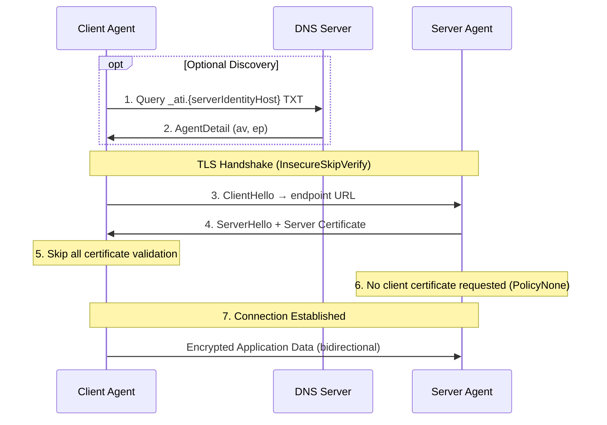
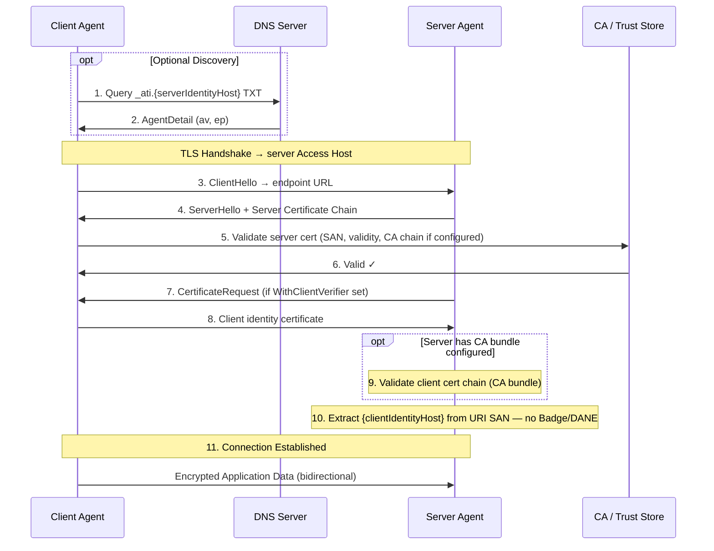
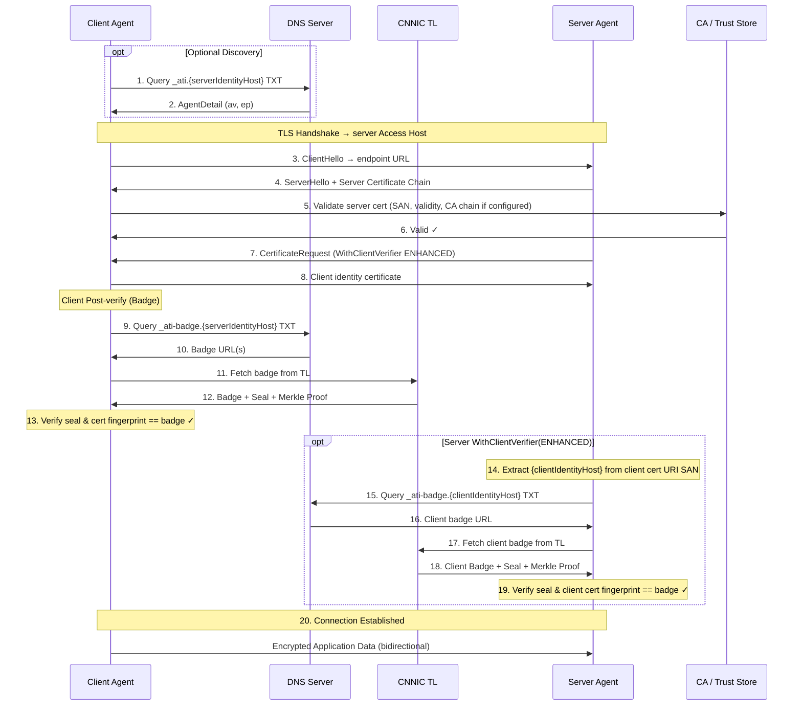
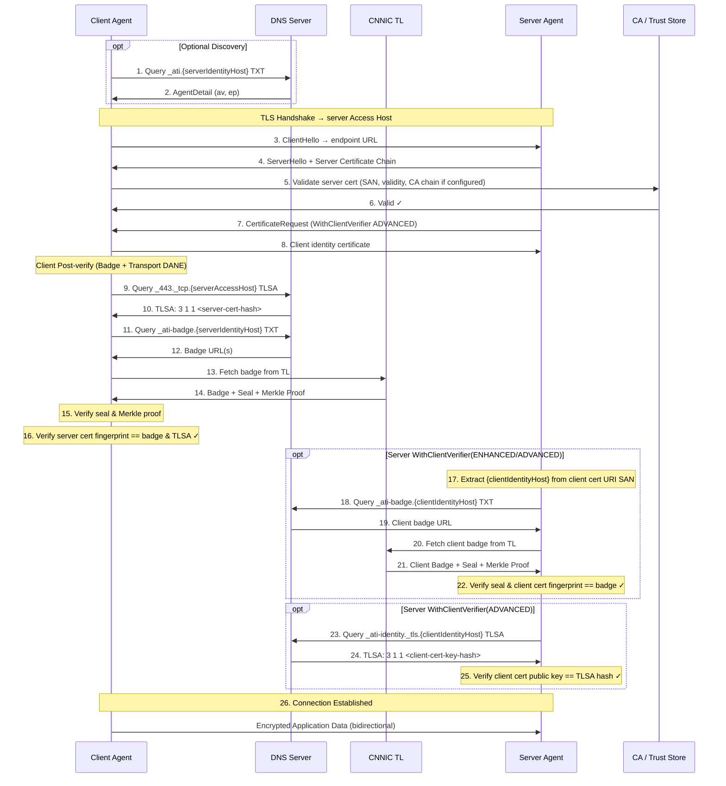

# ATI Go SDK

> Agent Trust Infrastructure (ATI) Go SDK — secure agent-to-agent communication with DNS TXT discovery, DANE TLSA verification, and transparency log attestation.

[English](README.md) | [中文](README_zh.md)

## Features

- **DNS TXT agent discovery** — resolve agents via `_ati.{identityHost}` TXT records with optional SemVer constraints
- **DANE TLSA verification** — verify server/client certificates via DNS TLSA records with DNSSEC
- **Badge verification** — cryptographically verify agent registration via the CNNIC Transparency Log
- **IDCA CRL certificate revocation (server)** — PKIX CRL from CDP at the TLS layer with fail-closed semantics
- **mTLS secure connections** — mutual TLS with identity certificate support (self-signed allowed)
- **Dual-hostname model** — separate Identity Hostname and Access Hostname for proxy/gateway deployments
- **Zero-dependency init** — single `ati.Init()` call for global configuration

## Verification Policies

| Policy | TLS | DANE | Badge | Scope | Description |
|--------|-----|------|-------|-------|-------------|
| `PolicyNone` | - | - | - | Client & server | No verification (dev/test only) |
| `PolicyBasic` | ✓ | - | - | Client & server | Standard TLS only |
| `PolicyEnhanced` | ✓ | - | ✓ | Client & server | TLS + Badge verification (default) |
| `PolicyAdvanced` | ✓ | ✓ | ✓ | Client & server | TLS + DANE + Badge |

Client agents default to `PolicyEnhanced` when `WithTrustLevel` is not specified. Server agents verify nothing unless `WithClientVerifier` is called.

### What Each Level Does

**PolicyBasic — Standard Certificate Validation**

Standard TLS certificate checks: validity period, SAN hostname match. CA chain validation is **conditional** — only performed when a private CA bundle is configured via `WithClientCA` or `WithMTLSCerts`. Without a CA bundle, any certificate is accepted; trust is established by higher levels (Badge/TLog). Identity certificates may be self-signed.

**PolicyEnhanced — Transparency Log Badge Verification**

After PKI passes, the SDK:

1. Queries DNS `_ati-badge.<host>` TXT to obtain the agent's **Badge URL** (pointing to the Transparency Log)
2. Fetches the registration record from the Transparency Log (containing the authoritative certificate fingerprint, Merkle proof, etc.)
3. Compares the **actual peer certificate fingerprint** against the fingerprint registered in the Transparency Log

Only matching fingerprints pass. This step answers: "Is the peer the registered agent it claims to be?" — preventing impersonation with a valid but mismatched certificate.

**PolicyAdvanced — DANE/TLSA Dual Binding**

After Badge passes, the SDK additionally queries DNSSEC-protected TLSA records to bind the certificate fingerprint against the **domain owner's published fingerprint in DNS**:

- Client verifying Server: queries `_443._tcp.<host>` TLSA
- Server verifying Client: queries `_ati-identity._tls.<host>` TLSA

This extends the trust anchor from the Transparency Log to "domain owner + DNSSEC trust chain" — even if the Transparency Log is compromised, an attacker must also control the target domain's DNSSEC signing to forge identity.

## Verification Sequence Diagrams

The diagrams below use `{serverIdentityHost}`, `{serverAccessHost}`, and `{clientIdentityHost}`. In **single-hostname mode**, `{serverIdentityHost}` equals `{serverAccessHost}` — Discovery, Badge, and transport DANE all target the same FQDN.

**Notes:**

- **Discovery (steps 1–2)** is optional — skip when connecting directly via a known `agentUrl`.
- **Client and server policies are configured independently** — e.g. client `ENHANCED` does not imply the server runs client verification steps unless the server policy is also `ENHANCED` or `ADVANCED`.
- **Server-side dual-track revocation** — when CA bundle is configured, **Certificate Revocation** (CRL at TLS) and **Registration Revocation** (Badge) are independent; either failure rejects.
- **`PolicyNone` skips all verification** — clients skip TLS cert validation; servers don't request client certificates.

### Dual Hostname Model (Shared Platform)

Multiple agents share one **Access Hostname**; each agent's **Identity Hostname** is a first-level subdomain.

| Hostname | Definition | Example |
|----------|------------|---------|
| **Server Identity Hostname** `{serverIdentityHost}` | Unique identity of the server agent — used for Discovery, Badge, identity DANE | `abc123.bailian.aliyun.com` |
| **Server Access Hostname** `{serverAccessHost}` | Shared domain for reaching the server — TLS connects here | `bailian.aliyun.com` |
| **Client Identity Hostname** `{clientIdentityHost}` | Unique identity of the client agent — extracted from client Identity Certificate URI SAN | `xyz789.caller.example.com` |

DNS lookups:

| Hostname | Records |
|----------|---------|
| `{serverIdentityHost}` | `_ati` (Discovery), `_ati-badge` (Badge) |
| `{serverAccessHost}` | `_443._tcp` (server transport DANE) |
| `{clientIdentityHost}` | `_ati-badge`, `_ati-identity._tls` (server-side Client Verification) |

### Single Hostname Model

One agent owns a dedicated domain; **Identity Hostname equals Access Hostname**.

| Hostname | Definition | Example |
|----------|------------|---------|
| **Server Identity Hostname** `{serverIdentityHost}` | Same as Access Hostname — all lookups on one FQDN | `agent.example.com` |
| **Server Access Hostname** `{serverAccessHost}` | Equals `{serverIdentityHost}` | `agent.example.com` |
| **Client Identity Hostname** `{clientIdentityHost}` | Client agent identity (unchanged) | `caller.example.com` |

DNS lookups (server-side records collapse onto one FQDN):

| Hostname | Records |
|----------|---------|
| `{serverIdentityHost}` (= `{serverAccessHost}`) | `_ati` (Discovery), `_ati-badge` (Badge), `_443._tcp` (transport DANE) |
| `{clientIdentityHost}` | `_ati-badge`, `_ati-identity._tls` (server-side Client Verification) |

### NONE (L0): No Verification (dev/test only)



### BASIC (L1): Agent Discovery + Standard TLS



### ENHANCED (L2): TLS + Transparency Log Verification



### ADVANCED (L3): Full Verification



## Packages

| Package | Import Path | Description |
|---------|-------------|-------------|
| `ati` | `github.com/aliyun/alibaba-ati-golang-sdk/ati` | Client, server, configuration entry point |
| `verify` | `github.com/aliyun/alibaba-ati-golang-sdk/verify` | DNS resolver, Badge verifier, DANE verifier, CRL checker |
| `models` | `github.com/aliyun/alibaba-ati-golang-sdk/models` | Shared data models |

## Installation

```bash
go get github.com/aliyun/alibaba-ati-golang-sdk
```

Import the main packages:

```go
import (
    "github.com/aliyun/alibaba-ati-golang-sdk/ati"    // Client / Server entry point
    "github.com/aliyun/alibaba-ati-golang-sdk/verify" // Resolver / verifiers
)
```

Requirements: Go 1.25+

## Quick Start

### Agent Registration

Agent registration is completed in the [Alibaba Cloud ATI Console](https://dnsnext.console.aliyun.com/ati/agents). The registration flow:

```
┌──────────────┐    ┌──────────────┐    ┌──────────────┐    ┌──────────────┐
│   Generate   │───▶│    Submit    │───▶│  ACME + DNS  │───▶│    ACTIVE    │
│ Identity CSR │    │  to Console  │    │ Verification │    │(Discoverable)│
└──────────────┘    └──────────────┘    └──────────────┘    └──────────────┘
```

1. **Generate identity key pair** — Create RSA/EC key pair for identity certificate (offline)
2. **Generate identity CSR** — Create Certificate Signing Request with an `ati://` URI SAN (Identity Hostname)
3. **Submit registration** — Input service certificate + identity CSR in ATI Console with agentHost, version, endpoints
4. **ACME verification** — Add DNS TXT record for domain ownership proof
5. **Identity certificate issuance** — CNNIC issues the identity certificate via IDCA
6. **DNS verification** — Add TLSA and badge DNS records
7. **Active** — Agent is discoverable via `_ati.{identityHost}` DNS TXT

> **Note:** All steps are performed in the ATI Console. No SDK code is needed for registration.

### Global Configuration

Initialize the SDK with `ati.Init` before creating clients or servers:

```go
import "github.com/aliyun/alibaba-ati-golang-sdk/ati"

err := ati.Init(ati.Config{
    LocalHostname:    "my-agent.example.com", // Required: this agent's hostname
    IdentityCertFile: "certs/identity.crt",   // Required: identity certificate
    IdentityKeyFile:  "certs/identity.key",   // Required: identity private key
    CARootFile:       "certs/root-ca.pem",    // Optional: CA bundle (enables PKI chain validation)
    TrustLevel:       ati.PolicyEnhanced,     // Optional: default PolicyEnhanced
    DNSServer:        "8.8.8.8:53",           // Optional: DANE resolver DNS server
})
```

### Agent-to-Agent Connection (Client)

```go
package main

import (
    "context"
    "fmt"
    "io"
    "log"

    "github.com/aliyun/alibaba-ati-golang-sdk/ati"
)

func main() {
    if err := ati.Init(ati.Config{
        LocalHostname:    "my-agent.example.com",
        IdentityCertFile: "certs/client.crt",
        IdentityKeyFile:  "certs/client.key",
    }); err != nil {
        log.Fatal(err)
    }

    // Identity certificate must contain ati:// URI SAN (may be self-signed)
    client, err := ati.NewAgentClient(
        ati.WithIdentityCert("certs/client.crt", "certs/client.key"),
        // Default: PolicyEnhanced (Badge verification)
    )
    if err != nil {
        log.Fatal(err)
    }

    resp, err := client.Get(context.Background(), "https://target-agent.example.com/api/data")
    if err != nil {
        log.Fatal(err) // Returns error if verification policy not met
    }
    defer resp.Body.Close()

    o := resp.VerificationOutcome
    fmt.Printf("Achieved=%s  Badge=%v  DANE=%v\n", o.AchievedLevel, o.BadgeVerified, o.DANEVerified)

    body, _ := io.ReadAll(resp.Body)
    fmt.Println(string(body))
}
```

### Agent Server

```go
package main

import (
    "fmt"
    "log"
    "net/http"

    "github.com/aliyun/alibaba-ati-golang-sdk/ati"
)

func main() {
    tlsConfig, err := ati.NewServerTLSConfig(
        ati.WithServerCert("certs/server.crt", "certs/server.key"),
        ati.WithClientVerifier(ati.PolicyEnhanced), // Require Badge verification
    )
    if err != nil {
        log.Fatal(err)
    }

    mux := http.NewServeMux()
    mux.HandleFunc("/hello", func(w http.ResponseWriter, r *http.Request) {
        peer, _ := ati.PeerATIName(r.TLS)
        fmt.Fprintf(w, "hello, %s", peer.Host)
    })

    server := &http.Server{Addr: ":8443", TLSConfig: tlsConfig, Handler: mux}
    log.Fatal(server.ListenAndServeTLS("", "")) // Certs already in tlsConfig
}
```

## Configuration

### Client Options

```go
client, err := ati.NewAgentClient(
    ati.WithIdentityCert("client.crt", "client.key"),   // Required
    ati.WithTrustLevel(ati.PolicyEnhanced),             // Optional: default PolicyEnhanced
    ati.WithClientTimeout(30 * time.Second),            // Optional: default 30s
)
```

| Option | Required | Description |
|--------|----------|-------------|
| `WithIdentityCert(certFile, keyFile)` | **Yes** | Client identity certificate + private key. Must contain `ati://` URI SAN; may be self-signed. |
| `WithMTLSCerts(id, key, serverCert, caBundle)` | Alternative | Use when private CA bundle is needed for server cert validation. Pass empty `serverCert`. CA chain validation only runs when CA bundle is provided. |
| `WithTrustLevel(level)` | No | Target verification policy. Default: `PolicyEnhanced`. |
| `WithClientTimeout(d)` | No | HTTP request timeout. Default: 30s. |
| `WithIdentityHost(host)` | No | Hostname for Badge and identity DANE queries. Default: connection URL host. See [Dual-hostname Model](#dual-hostname-model-shared-platform). |
| `WithAccessHost(host)` | No | Hostname for transport DANE (`_443._tcp`) queries. Default: connection URL host. |
| `WithTargetVersion(version)` | No | SemVer constraint for discovery. See [Version Constraints](#version-constraints). |
| `WithAgentDANEResolver(r)` | No | Override the default DANE resolver (auto-created for `PolicyAdvanced`). |
| `WithTLogClient(t)` | No | Custom Transparency Log client (for testing or private deployments). |
| `WithDNSResolver(r)` | No | Custom DNS resolver (primarily for testing). |
| `WithTLPublicKey(key)` | No | Pre-loaded TL public key for Gold-level seal verification. |

### Server Options

```go
tlsConfig, err := ati.NewServerTLSConfig(
    ati.WithServerCert("server.crt", "server.key"),  // Required
    ati.WithClientCA("client-ca-bundle.pem"),        // Optional: CA bundle
    ati.WithClientVerifier(ati.PolicyEnhanced),      // Optional: client verification
    ati.WithCRLCheck(),                              // Optional: enable CRL
)
```

| Option | Required | Description |
|--------|----------|-------------|
| `WithServerCert(certFile, keyFile)` | **Yes** | Server certificate + private key. Recommend public CA-issued with DNS SAN. |
| `WithClientCA(caBundle)` | No | Private CA bundle for client cert chain validation. When set, Go TLS uses `RequireAndVerifyClientCert`. |
| `WithClientVerifier(level)` | No | Server's verification policy for clients. **Not set = no client verification** (no client cert requested). |
| `WithCRLCheck()` | No | Explicitly enable CRL revocation checking. Auto-enabled when CA bundle + trust level are set. |
| `WithCRLCheckDisabled()` | No | Explicitly disable CRL checking (even with CA bundle). |
| `WithCRLHTTPClient(client)` | No | Custom HTTP client for CRL downloads. |
| `WithServerDANEResolver(r)` | No | Override default DANE resolver (auto-created for `PolicyAdvanced`). |
| `WithPeerLevelStore(store)` | No | Inject shared `sync.Map` to record each peer's achieved level. |

### Server Verification Behavior Matrix

The combination of `WithClientVerifier` and `WithClientCA` determines the server's client authentication behavior:

| `WithClientVerifier` | `WithClientCA` | TLS ClientAuth | Behavior |
|:---:|:---:|---|---|
| Not set | Not set | `NoClientCert` | **No verification** — no client cert requested |
| `PolicyNone` | Not set | `NoClientCert` | Explicitly no verification |
| Not set | Set | `RequireAndVerifyClientCert` | Implicit `PolicyBasic` + CA chain |
| Set | Not set | `RequireAnyClientCert` | Verify at specified level; self-signed certs trusted via Badge/TLog |
| Set | Set | `RequireAndVerifyClientCert` | Verify at specified level + CA chain + CRL (auto-enabled) |

> Setting a CA bundle (`WithClientCA`) implies "authenticate clients" — even without `WithClientVerifier`, it implicitly runs `PolicyBasic`.

### Verification Policy

```go
// BASIC — TLS with system CA only
client, _ := ati.NewAgentClient(
    ati.WithIdentityCert("client.crt", "client.key"),
    ati.WithTrustLevel(ati.PolicyBasic),
)

// ENHANCED — TLS + Badge (dual-hostname: set identityHost)
client, _ := ati.NewAgentClient(
    ati.WithIdentityCert("client.crt", "client.key"),
    ati.WithTrustLevel(ati.PolicyEnhanced),
    ati.WithIdentityHost("abc123.bailian.aliyun.com"),
)

// ADVANCED — ENHANCED + transport DANE (set accessHost for _443._tcp)
client, _ := ati.NewAgentClient(
    ati.WithIdentityCert("client.crt", "client.key"),
    ati.WithTrustLevel(ati.PolicyAdvanced),
    ati.WithIdentityHost("abc123.bailian.aliyun.com"),
    ati.WithAccessHost("bailian.aliyun.com"),
)
```

### Dual-Hostname Model

When an agent is exposed through a proxy/gateway, the access address differs from the agent's identity:

```go
client, err := ati.NewAgentClient(
    ati.WithIdentityCert("client.crt", "client.key"),
    ati.WithTrustLevel(ati.PolicyAdvanced),
    ati.WithIdentityHost("my-agent.internal"),   // Badge + _ati-identity DANE queries
    ati.WithAccessHost("gateway.example.com"),   // _443._tcp transport DANE queries
)

// Request goes to gateway, but identity verification uses my-agent.internal
resp, err := client.Get(ctx, "https://gateway.example.com/api")
```

When not specified, both default to the connection URL host.

### DNS Server

DANE/TLSA relies on DNSSEC-aware resolvers. The system default resolver (`/etc/resolv.conf`) often doesn't support DNSSEC. Configure via `ati.Init`:

```go
ati.Init(ati.Config{
    // ... other fields ...
    DNSServer: "8.8.8.8:53", // Also accepts "8.8.8.8" (port defaults to 53)
})
```

- Only affects the **auto-created DANE resolver** (when `PolicyAdvanced` is used without an explicit DANE resolver)
- Default fallback: `8.8.8.8:53`
- Has no effect when `WithAgentDANEResolver` / `WithServerDANEResolver` explicitly provides a resolver

## Agent Discovery (DNS TXT)

Agent discovery uses DNS `_ati` TXT records. The SDK automatically performs discovery during client creation and requests.

### TXT Record Format

```
_ati.<host>  TXT  "v=ati1; id=<agentId>; ra=aliyun; version=v1.2.0; p=a2a; url=https://tl.atiagent.cn/api/v1/agents/<agentId>"
```

| Field | Alias | Required | Description |
|-------|-------|----------|-------------|
| `v` | — | Yes | Magic header, must be `ati1` |
| `version` | `ver` | Yes | Agent version (SemVer format) |
| `id` | — | No | Agent ID |
| `ra` | — | No | Registration Authority (e.g., `aliyun`) |
| `p` | `proto` | No | Protocol filter (`mcp`/`a2a`/`openapi`), empty = wildcard |
| `url` | — | No | Metadata endpoint URL |
| `mode` | — | No | `card` (default when url present) or `direct` |

### Usage

Discovery is performed automatically — no separate API call needed. Inject a custom resolver via `WithDNSResolver` for testing.

## Version Constraints

When discovering agents, specify a version constraint to select a specific agent version via `WithTargetVersion`:

| Constraint | Matches |
|------------|---------|
| `1.2.3` or `v1.2.3` | Exact version 1.2.3 |
| `^1.2.0` | Compatible with 1.2.0 (>=1.2.0 <2.0.0) |
| `~1.2.0` | Approximately 1.2.0 (>=1.2.0 <1.3.0) |
| `>=1.0.0` | All versions >= 1.0.0 |
| `>=1.0.0 <2.0.0` | Range expression |
| Not specified | Latest version from all records |

```go
client, err := ati.NewAgentClient(
    ati.WithIdentityCert("client.crt", "client.key"),
    ati.WithTargetVersion("^1.2.0"), // Match 1.x.y (>=1.2.0, <2.0.0), select newest
)
```

Matching logic:

1. Parse all `version` fields from `_ati` DNS TXT records
2. Filter records matching the SemVer constraint
3. Select the highest version among matches
4. Return error if no match found

Uses: `github.com/Masterminds/semver/v3`

## CRL Certificate Revocation

Server-side mTLS CRL checking validates whether client identity certificates have been revoked.

### How It Works

1. **CDP Discovery** — Reads CRL Distribution Point URLs from client leaf cert's `CRLDistributionPoints` extension; falls back to issuing CA cert; skips CRL if no CDP found (debug log)
2. **CRL Fetch** — HTTP(S) GET from CDP URI, verifies signature with issuing CA public key
3. **Revocation Check** — Rejects connection if client certificate serial number is in the CRL

### Fail-Closed Semantics

When CDP is present, the SDK uses fail-closed:

| Scenario | Result |
|----------|--------|
| CRL fetch failure | Reject mTLS |
| Invalid CRL signature | Reject mTLS |
| CRL parse failure | Reject mTLS |
| CDP present but no valid HTTP(S) URI | Reject mTLS |
| No CDP in certificate chain | Skip CRL (debug log) |

### Configuration

```go
tlsConfig, err := ati.NewServerTLSConfig(
    ati.WithServerCert("server.crt", "server.key"),
    ati.WithClientCA("ca-bundle.pem"),
    ati.WithClientVerifier(ati.PolicyEnhanced),
    ati.WithCRLCheck(),                              // Explicit enable
    // ati.WithCRLCheckDisabled(),                   // Explicit disable
    // ati.WithCRLHTTPClient(customHTTPClient),      // Custom HTTP client
)
```

### Cache Policy

- CRL cached by CDP URI
- Refreshed when `nextUpdate` is reached; expired CRLs force immediate re-fetch
- Maximum cache duration: 12 hours

### Security Protections

- **SSRF protection**: CDP URIs resolving to private/loopback/link-local/metadata addresses are rejected
- **Memory protection**: CRL response body limited to 10 MiB

## Reading Verification Results

Every `*ati.Response` includes a `VerificationOutcome`:

```go
o := resp.VerificationOutcome

o.DNSDiscovered  // bool        Discovery succeeded (DNS TXT _ati record)
o.CAChainValid   // bool        CA chain valid (true when no CA bundle configured)
o.SANMatches     // bool        Certificate SAN matches target host
o.BadgeVerified  // bool        Badge verification passed
o.DANEVerified   // bool        DANE/TLSA verification passed
o.AchievedLevel  // VerificationPolicy  Highest level actually achieved
o.RequestedLevel // *VerificationPolicy Requested level
o.PeerATIName    // string      Peer ATI Name, e.g. "ati://v1.0.0.agent.example.com"
o.AgentID        // string      Peer Agent ID
o.BadgeOutcome   // *verify.VerificationOutcome  Badge details
o.DANEDetails    // *verify.DANEOutcome          DANE details
```

### Reading Peer Identity (Server-side)

```go
func handler(w http.ResponseWriter, r *http.Request) {
    peer, err := ati.PeerATIName(r.TLS)
    if err != nil {
        http.Error(w, "unknown peer", http.StatusForbidden)
        return
    }
    _ = peer.Host    // "client-agent.example.com"
    _ = peer.Version // "1.2.0"
    _ = peer.Raw     // "ati://v1.2.0.client-agent.example.com"
}
```

### Certificate Status Check

```go
st := client.CertStatus()
fmt.Printf("Expires %s, %d days remaining\n", st.ExpiresAt.Format("2006-01-02"), st.DaysRemaining)
if st.IsExpired {
    log.Fatal("identity certificate expired")
}
```

## Verification Cache and Failure Semantics

- **Cache**: Client caches verification results per `(host, cert fingerprint)`. Subsequent requests to the same host with the same certificate skip repeated verification.
- **DANE fail-open**: DANE only rejects on an **explicit negative judgment** — TLSA record exists under DNSSEC but doesn't match the presented certificate (`DANEMismatch`), or DNSSEC validation explicitly fails (`DANEDNSSECFailed`). These benign scenarios **do not reject**: no TLSA record published (`DANENoRecords`), record exists but no DNSSEC chain (`DANESkipped`). Pure DNS query errors are left to the caller's failure policy.
- **CRL fail-closed**: Unlike DANE, CRL uses fail-closed when CDP is present — fetch failure, invalid signature, or parse error all reject the mTLS connection.

## Certificate Requirements and ATI Name

| Certificate Type | `ati://` URI SAN | CA-Issued | Purpose |
|-----------------|------------------|-----------|---------|
| Client identity certificate | **Required** | May be self-signed | Identifies agent; trust established via Badge/TLog fingerprint |
| Server certificate | Recommended | Recommend public CA | TLS server authentication; DNS SAN must match hostname |

**ATI Name format** (embedded in certificate URI SAN, globally unique agent identifier):

```
ati://v{major}.{minor}.{patch}.{host}
```

Example: `ati://v1.0.0.my-agent.example.com`

## DNS Record Reference

| Record | Type | Purpose | Policy Requirement |
|--------|------|---------|-------------------|
| `_ati.<host>` | TXT | Agent discovery (endpoint + version) | All levels |
| `_ati-badge.<host>` | TXT | Badge URL (pointing to Transparency Log) | PolicyEnhanced and above |
| `_443._tcp.<host>` | TLSA | Server certificate DANE binding | PolicyAdvanced (client verifying server) |
| `_ati-identity._tls.<host>` | TLSA | Client identity certificate DANE binding | PolicyAdvanced (server verifying client) |

## Backward Compatibility

Legacy constants are still usable but marked as Deprecated:

| Legacy Name | New Name |
|-------------|----------|
| `TrustLevel` | `VerificationPolicy` |
| `PKIOnly` | `PolicyBasic` |
| `BadgeRequired` | `PolicyEnhanced` |
| `DANEAndBadge` | `PolicyAdvanced` |

## Examples

The SDK includes runnable examples in the [`examples/`](examples/) directory:

### Agent Server ([examples/agent-server](examples/agent-server))

An ATI agent server that starts HTTPS and verifies callers.

```bash
cd examples/agent-server
go run main.go \
  -cert server.crt \
  -key server.key \
  -addr :8443 \
  -trust enhanced
```

### Agent Client ([examples/agent-client](examples/agent-client))

An ATI agent client that sends verified HTTPS requests to a target agent.

```bash
cd examples/agent-client
go run main.go \
  -cert client.crt \
  -key client.key \
  -url https://target-agent.example.com:8443/hello \
  -trust enhanced
```

## Build

```bash
go build ./...
go test ./...
```

Requirements: Go 1.25+

## License

[MIT](LICENSE)

## Contributing

See [CONTRIBUTING.md](CONTRIBUTING.md)
