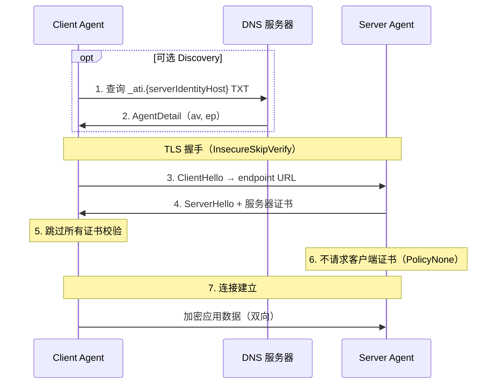
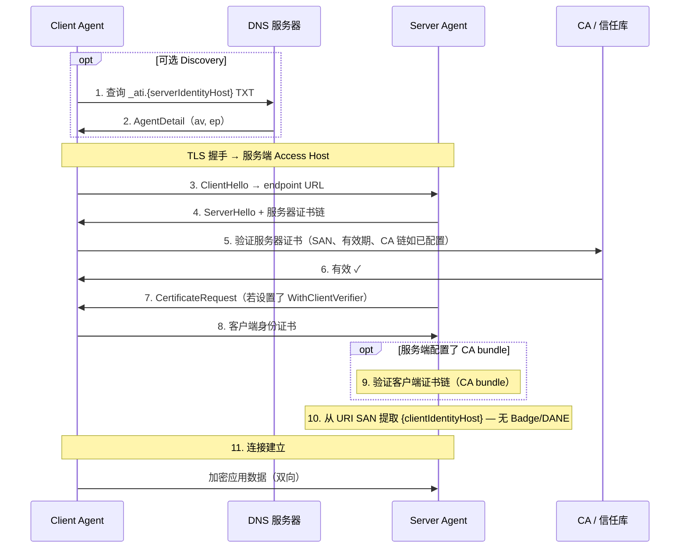
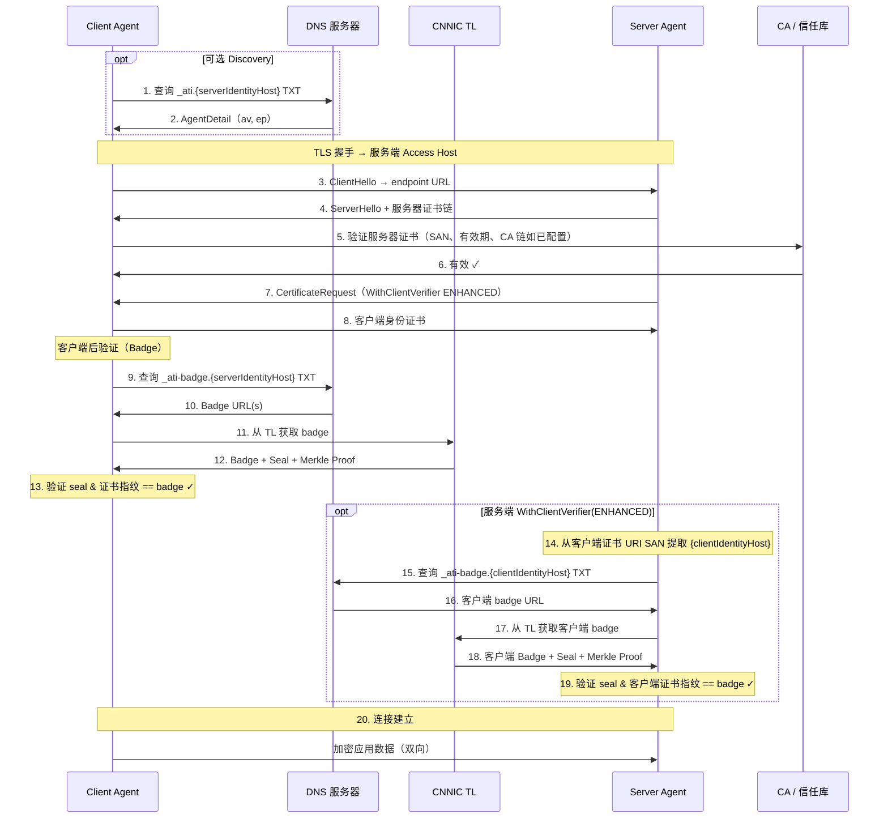
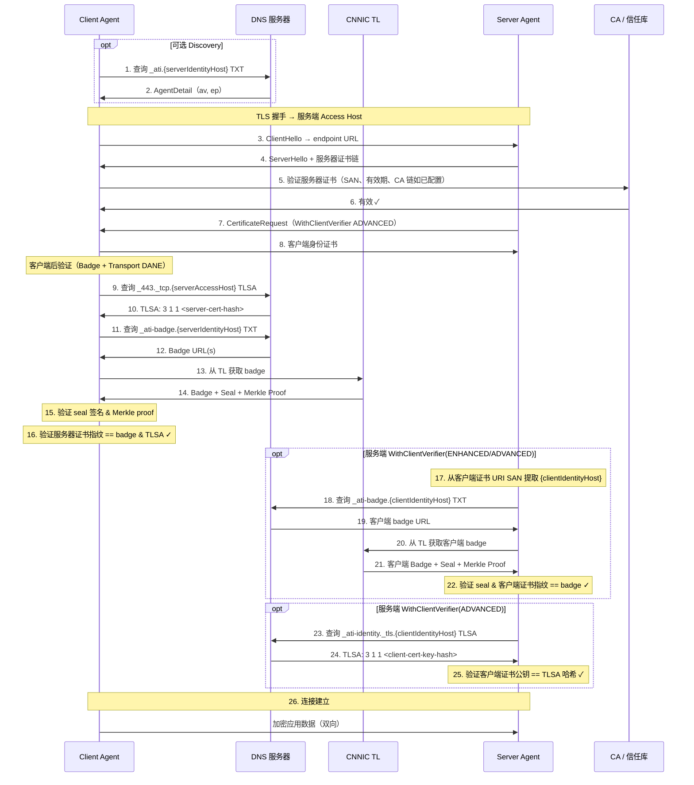

# ATI Go SDK

> Agent 信任基础设施 (ATI) Go SDK — 通过 DNS TXT 发现、DANE TLSA 验证和透明日志认证，实现安全的 Agent 间通信。

[English](README.md) | [中文](README_zh.md)

## 特性

- **基于 DNS TXT 的 Agent 发现** — 通过 `_ati.{identityHost}` TXT 记录解析 Agent，支持 SemVer 版本约束
- **DANE TLSA 验证** — 通过 DNS TLSA 记录配合 DNSSEC 验证服务端/客户端证书
- **Badge 验证** — 通过 CNNIC 透明日志（Transparency Log）加密验证 Agent 注册信息
- **IDCA CRL 证书吊销（服务端）** — 在 TLS 层通过 CDP/CRL 校验，采用 fail-closed 策略
- **mTLS 安全连接** — 支持身份证书的双向 TLS（允许自签证书）
- **Dual-hostname 模型** — 分离 Identity Hostname 和 Access Hostname，适配代理/网关部署
- **零依赖初始化** — 单一 `ati.Init()` 调用完成全局配置

## 验证策略

| 策略 | TLS | DANE | Badge | 适用范围 | 说明 |
|------|-----|------|-------|----------|------|
| `PolicyNone` | - | - | - | 客户端 & 服务端 | 不做验证（仅开发/测试） |
| `PolicyBasic` | ✓ | - | - | 客户端 & 服务端 | 仅标准 TLS |
| `PolicyEnhanced` | ✓ | - | ✓ | 客户端 & 服务端 | TLS + Badge 验证（默认） |
| `PolicyAdvanced` | ✓ | ✓ | ✓ | 客户端 & 服务端 | TLS + DANE + Badge |

客户端不指定 `WithTrustLevel` 时默认使用 `PolicyEnhanced`。服务端不调用 `WithClientVerifier` 时不做任何客户端验证。

### 每一级具体在做什么

**PolicyBasic — 基础证书校验**

沿用标准 TLS 的证书检查：证书是否在有效期内、证书 SAN 是否与你要访问的主机名一致。CA 链校验是**有条件**的——**只有当你配置了私有根证书（CA bundle）时才会做 CA 链校验**；不配置时不校验 CA 链（接受任意证书），信任交由更高等级（Badge/TLog）建立。身份证书允许自签。

**PolicyEnhanced — 身份徽章验证**

在 PKI 通过后，SDK 会：

1. 查询 DNS `_ati-badge.<host>` TXT 记录，拿到该 Agent 的 **Badge URL**（指向透明日志 Transparency Log）
2. 从透明日志取回该 Agent 的登记记录（含权威签发的证书指纹、Merkle 证明等）
3. 把**对端实际出示的证书指纹**与透明日志中登记的指纹做比对

只有指纹一致才算通过。这一步回答的是"对端是不是它声称的那个已登记 Agent"，防止拿一张合法但身份不符的证书冒充。

**PolicyAdvanced — DANE/TLSA 双重绑定**

在 Badge 通过后，再查询 DNSSEC 保护下的 TLSA 记录，把证书指纹与**域名所有者在 DNS 中发布的指纹**再绑定一次：

- Client 验 Server：查 `_443._tcp.<host>` 的 TLSA
- Server 验 Client：查 `_ati-identity._tls.<host>` 的 TLSA

这一步把"信任锚"从透明日志扩展到"域名所有者 + DNSSEC 信任链"，即使透明日志被绕过，攻击者仍需同时控制目标域名的 DNSSEC 签名才能伪造。

## 验证时序图

下方时序图使用 `{serverIdentityHost}`、`{serverAccessHost}` 与 `{clientIdentityHost}` 占位符。**单域名模式**下 `{serverIdentityHost}` 等于 `{serverAccessHost}` — Discovery、Badge 与传输层 DANE 均指向同一 FQDN。

**说明：**

- **Discovery（步骤 1–2）为可选** — 已知 `agentUrl` 直接连接时可跳过。
- **客户端与服务端 policy 独立配置** — 例如客户端 `ENHANCED` 不意味着服务端会执行客户端验证步骤，除非服务端 policy 也为 `ENHANCED`/`ADVANCED`。
- **服务端双轨吊销** — 配置 CA bundle 后，**Certificate Revocation**（CRL）与 **Registration Revocation**（Badge）相互独立，任一失败即拒绝。
- **`PolicyNone` 跳过所有验证** — 客户端跳过 TLS 证书校验；服务端不请求客户端证书。

### 双 Hostname 模型（共享平台）

多个 Agent 共享一个 **Access Hostname**；每个 Agent 的 **Identity Hostname** 为其一级子域名。

| Hostname | 定义 | 示例 |
|----------|------|------|
| **服务端 Identity Hostname** `{serverIdentityHost}` | 服务端 Agent 的唯一身份标识 — 用于 Discovery、Badge、identity DANE | `abc123.bailian.aliyun.com` |
| **服务端 Access Hostname** `{serverAccessHost}` | 访问服务端的通用域名 — TLS 连接于此 | `bailian.aliyun.com` |
| **客户端 Identity Hostname** `{clientIdentityHost}` | 客户端 Agent 的唯一身份标识 — 从客户端 Identity Certificate URI SAN 提取 | `xyz789.caller.example.com` |

时序图中的 DNS 查询对应关系：

| Hostname | 记录 |
|----------|------|
| `{serverIdentityHost}` | `_ati`（Discovery）、`_ati-badge`（Badge） |
| `{serverAccessHost}` | `_443._tcp`（服务端传输层 DANE） |
| `{clientIdentityHost}` | `_ati-badge`、`_ati-identity._tls`（服务端 Client Verification） |

### 单 Hostname 模型

单个 Agent 独占一个域名；**Identity Hostname 等于 Access Hostname**。

| Hostname | 定义 | 示例 |
|----------|------|------|
| **服务端 Identity Hostname** `{serverIdentityHost}` | 与 Access Hostname 相同 — 所有查询在同一 FQDN | `agent.example.com` |
| **服务端 Access Hostname** `{serverAccessHost}` | 等于 `{serverIdentityHost}` | `agent.example.com` |
| **客户端 Identity Hostname** `{clientIdentityHost}` | 客户端 Agent 身份（不变） | `caller.example.com` |

时序图中的 DNS 查询对应关系（服务端记录合并到同一 FQDN）：

| Hostname | 记录 |
|----------|------|
| `{serverIdentityHost}`（= `{serverAccessHost}`） | `_ati`（Discovery）、`_ati-badge`（Badge）、`_443._tcp`（传输层 DANE） |
| `{clientIdentityHost}` | `_ati-badge`、`_ati-identity._tls`（服务端 Client Verification） |

### NONE（L0）：无验证（仅开发/测试）



### BASIC（L1）：Agent 发现 + 标准 TLS



### ENHANCED（L2）：TLS + 透明日志验证



### ADVANCED（L3）：完整验证



## 包结构

| 包 | 导入路径 | 说明 |
|---|---------|------|
| `ati` | `github.com/aliyun/alibaba-ati-golang-sdk/ati` | 客户端、服务端、配置入口 |
| `verify` | `github.com/aliyun/alibaba-ati-golang-sdk/verify` | DNS 解析器、Badge 验证器、DANE 验证器、CRL 检查器 |
| `models` | `github.com/aliyun/alibaba-ati-golang-sdk/models` | 共享数据模型 |

## 安装

```bash
go get github.com/aliyun/alibaba-ati-golang-sdk
```

导入主要包：

```go
import (
    "github.com/aliyun/alibaba-ati-golang-sdk/ati"    // 客户端 / 服务端入口
    "github.com/aliyun/alibaba-ati-golang-sdk/verify" // 解析器 / 验证器
)
```

环境要求：Go 1.25+

## 快速开始

### Agent 注册

Agent 注册在[阿里云 ATI 控制台](https://dnsnext.console.aliyun.com/ati/agents)完成。注册流程：

```
┌──────────────┐    ┌──────────────┐    ┌──────────────┐    ┌──────────────┐
│  生成身份密钥对 │───▶│  提交至控制台  │───▶│ ACME + DNS  │───▶│    已激活    │
│  + 身份 CSR   │    │              │    │   验证       │    │（可被发现）   │
└──────────────┘    └──────────────┘    └──────────────┘    └──────────────┘
```

1. **生成身份密钥对** — 线下为身份证书创建 RSA/EC 密钥对
2. **生成身份 CSR** — 创建包含 `ati://` URI SAN（Identity Hostname）的证书签名请求
3. **提交注册** — 在 ATI 控制台输入服务证书 + 身份 CSR，注册 agentHost、version、endpoints
4. **ACME 验证** — 添加 DNS TXT 记录证明域名所有权
5. **身份证书签发** — CNNIC 通过 IDCA 签发身份证书
6. **DNS 验证** — 添加 TLSA 和 badge DNS 记录
7. **激活** — Agent 可通过 `_ati.{identityHost}` DNS TXT 发现

> **注意：** 所有步骤均在 ATI 控制台完成，注册过程不需要 SDK 代码。

### 全局配置

在创建客户端或服务端之前，通过 `ati.Init` 初始化 SDK：

```go
import "github.com/aliyun/alibaba-ati-golang-sdk/ati"

err := ati.Init(ati.Config{
    LocalHostname:    "my-agent.example.com", // 必填：本 Agent 主机名
    IdentityCertFile: "certs/identity.crt",   // 必填：身份证书
    IdentityKeyFile:  "certs/identity.key",   // 必填：身份私钥
    CARootFile:       "certs/root-ca.pem",    // 可选：私有根证书（启用 PKI CA 链校验）
    TrustLevel:       ati.PolicyEnhanced,     // 可选：默认 PolicyEnhanced
    DNSServer:        "8.8.8.8:53",           // 可选：DANE 解析器使用的 DNS 服务器
})
```

### Agent 间连接（客户端）

```go
package main

import (
    "context"
    "fmt"
    "io"
    "log"

    "github.com/aliyun/alibaba-ati-golang-sdk/ati"
)

func main() {
    if err := ati.Init(ati.Config{
        LocalHostname:    "my-agent.example.com",
        IdentityCertFile: "certs/client.crt",
        IdentityKeyFile:  "certs/client.key",
    }); err != nil {
        log.Fatal(err)
    }

    // 身份证书必须包含 ati:// URI SAN，可自签
    client, err := ati.NewAgentClient(
        ati.WithIdentityCert("certs/client.crt", "certs/client.key"),
        // 默认：PolicyEnhanced（Badge 验证）
    )
    if err != nil {
        log.Fatal(err)
    }

    resp, err := client.Get(context.Background(), "https://target-agent.example.com/api/data")
    if err != nil {
        log.Fatal(err) // 达不到验证策略时返回 error
    }
    defer resp.Body.Close()

    o := resp.VerificationOutcome
    fmt.Printf("达成等级=%s  Badge=%v  DANE=%v\n", o.AchievedLevel, o.BadgeVerified, o.DANEVerified)

    body, _ := io.ReadAll(resp.Body)
    fmt.Println(string(body))
}
```

### Agent 服务端

```go
package main

import (
    "fmt"
    "log"
    "net/http"

    "github.com/aliyun/alibaba-ati-golang-sdk/ati"
)

func main() {
    tlsConfig, err := ati.NewServerTLSConfig(
        ati.WithServerCert("certs/server.crt", "certs/server.key"),
        ati.WithClientVerifier(ati.PolicyEnhanced), // 要求调用方通过 Badge 验证
    )
    if err != nil {
        log.Fatal(err)
    }

    mux := http.NewServeMux()
    mux.HandleFunc("/hello", func(w http.ResponseWriter, r *http.Request) {
        peer, _ := ati.PeerATIName(r.TLS)
        fmt.Fprintf(w, "hello, %s", peer.Host)
    })

    server := &http.Server{Addr: ":8443", TLSConfig: tlsConfig, Handler: mux}
    log.Fatal(server.ListenAndServeTLS("", "")) // 证书已在 tlsConfig 中，传空字符串
}
```

## 配置

### 客户端配置项

```go
client, err := ati.NewAgentClient(
    ati.WithIdentityCert("client.crt", "client.key"),   // 必填
    ati.WithTrustLevel(ati.PolicyEnhanced),             // 可选，默认 PolicyEnhanced
    ati.WithClientTimeout(30 * time.Second),            // 可选，默认 30s
)
```

| 选项 | 是否必填 | 说明 |
|------|---------|------|
| `WithIdentityCert(certFile, keyFile)` | **必填** | 客户端身份证书 + 私钥。必须含 `ati://` URI SAN，可自签。 |
| `WithMTLSCerts(id, key, serverCert, caBundle)` | 替代上一项 | 需要用私有根证书校验服务端证书时使用。`serverCert` 传空即可。传了 CA bundle 才做 PKI CA 链校验。 |
| `WithTrustLevel(level)` | 可选 | 目标验证策略。默认 `PolicyEnhanced`。 |
| `WithClientTimeout(d)` | 可选 | HTTP 请求超时。默认 30s。 |
| `WithIdentityHost(host)` | 可选 | Badge 和 identity DANE 查询使用的主机名。默认使用连接 URL host。见 [Dual-hostname 模型](#双-hostname-模型共享平台)。 |
| `WithAccessHost(host)` | 可选 | Transport DANE（`_443._tcp`）查询使用的主机名。默认使用连接 URL host。 |
| `WithTargetVersion(version)` | 可选 | 发现时指定版本约束。见 [版本匹配](#版本匹配)。 |
| `WithAgentDANEResolver(r)` | 可选 | 覆盖默认 DANE resolver（`PolicyAdvanced` 下自动创建）。 |
| `WithTLogClient(t)` | 可选 | 自定义透明日志客户端（测试或私有部署）。 |
| `WithDNSResolver(r)` | 可选 | 注入自定义 DNS 解析器（主要用于测试）。 |
| `WithTLPublicKey(key)` | 可选 | 预置 TL 公钥用于 Gold 级封条验证。 |

### 服务端配置项

```go
tlsConfig, err := ati.NewServerTLSConfig(
    ati.WithServerCert("server.crt", "server.key"),  // 必填
    ati.WithClientCA("client-ca-bundle.pem"),        // 可选：CA bundle
    ati.WithClientVerifier(ati.PolicyEnhanced),      // 可选：客户端验证
    ati.WithCRLCheck(),                              // 可选：启用 CRL
)
```

| 选项 | 是否必填 | 说明 |
|------|---------|------|
| `WithServerCert(certFile, keyFile)` | **必填** | 服务端证书 + 私钥。建议由公有 CA 签发，DNS SAN 含服务主机名。 |
| `WithClientCA(caBundle)` | 可选 | 私有根证书，设置后 Go TLS 层对客户端证书做 CA 链校验（`RequireAndVerifyClientCert`）。 |
| `WithClientVerifier(level)` | 可选 | 服务端对客户端的验证策略。**不传则什么都不验**（不请求客户端证书）。 |
| `WithCRLCheck()` | 可选 | 显式启用 CRL 吊销检查。有 CA bundle + trustLevel 时自动启用。 |
| `WithCRLCheckDisabled()` | 可选 | 显式关闭 CRL 检查（即使有 CA bundle 也不检查）。 |
| `WithCRLHTTPClient(client)` | 可选 | 自定义 CRL 下载使用的 HTTP 客户端。 |
| `WithServerDANEResolver(r)` | 可选 | 覆盖默认 DANE resolver（`PolicyAdvanced` 下自动创建）。 |
| `WithPeerLevelStore(store)` | 可选 | 注入共享 `sync.Map` 记录每个对端达成的等级。 |

### 服务端验证行为矩阵

`WithClientVerifier` 与 `WithClientCA` 的组合决定了服务端验证客户端的最终行为：

| `WithClientVerifier` | `WithClientCA` | TLS ClientAuth | 验证行为 |
|:---:|:---:|---|---|
| 不传 | 不传 | `NoClientCert` | **什么都不验**——不请求客户端证书，等同普通 TLS 直连 |
| `PolicyNone` | 不传 | `NoClientCert` | 显式不验证，不请求客户端证书 |
| 不传 | 传 | `RequireAndVerifyClientCert` | 隐含按 `PolicyBasic` 验证 + CA 链校验 |
| 传 | 不传 | `RequireAnyClientCert` | 按指定等级验证；自签证书靠 Badge/TLog 建立信任 |
| 传 | 传 | `RequireAndVerifyClientCert` | 按指定等级验证 + CA 链校验 + CRL 检查（自动启用） |

> 传了私有根证书（`WithClientCA`）即视为"要认证客户端"，因此即便没调用 `WithClientVerifier` 也会隐含按 `PolicyBasic` 走。

### 验证策略配置示例

```go
// BASIC — 仅 TLS + 系统 CA
client, _ := ati.NewAgentClient(
    ati.WithIdentityCert("client.crt", "client.key"),
    ati.WithTrustLevel(ati.PolicyBasic),
)

// ENHANCED — TLS + Badge（双 hostname 需设置 identityHost）
client, _ := ati.NewAgentClient(
    ati.WithIdentityCert("client.crt", "client.key"),
    ati.WithTrustLevel(ati.PolicyEnhanced),
    ati.WithIdentityHost("abc123.bailian.aliyun.com"),
)

// ADVANCED — ENHANCED + 传输层 DANE（设置 accessHost 用于 _443._tcp）
client, _ := ati.NewAgentClient(
    ati.WithIdentityCert("client.crt", "client.key"),
    ati.WithTrustLevel(ati.PolicyAdvanced),
    ati.WithIdentityHost("abc123.bailian.aliyun.com"),
    ati.WithAccessHost("bailian.aliyun.com"),
)
```

### Dual-Hostname 模型

当 Agent 通过代理网关暴露服务时，实际访问地址与 Agent 身份标识不同：

```go
client, err := ati.NewAgentClient(
    ati.WithIdentityCert("client.crt", "client.key"),
    ati.WithTrustLevel(ati.PolicyAdvanced),
    ati.WithIdentityHost("my-agent.internal"),   // Badge + _ati-identity DANE 查此主机
    ati.WithAccessHost("gateway.example.com"),   // _443._tcp Transport DANE 查此主机
)

// 请求发往 gateway，但身份验证查 my-agent.internal
resp, err := client.Get(ctx, "https://gateway.example.com/api")
```

不指定时两者均默认使用连接 URL 中的 host。

### 指定 DNS 服务器

DANE/TLSA 依赖 DNSSEC 可用的上游解析器。系统默认解析器（`/etc/resolv.conf`）通常不支持 DNSSEC。通过 `ati.Init` 配置：

```go
ati.Init(ati.Config{
    // ... 其他字段 ...
    DNSServer: "8.8.8.8:53", // 也可只写 "8.8.8.8"，端口默认 53
})
```

- 只作用于**自动创建的 DANE resolver**（即等级为 `PolicyAdvanced` 且未显式提供 DANE resolver 时）
- 不配置时兜底到公共解析器 `8.8.8.8:53`
- 若通过 `WithAgentDANEResolver` / `WithServerDANEResolver` 显式提供了 DANE resolver，则该字段不生效

## 服务发现（DNS TXT）

Agent 服务发现通过 DNS `_ati` TXT 记录完成。SDK 在客户端创建和请求时自动执行发现。

### TXT 记录格式

```
_ati.<host>  TXT  "v=ati1; id=<agentId>; ra=aliyun; av=1.2.0; p=a2a; u=https://ati-tl.cnnic.cn:8180/api/v1/agents/<agentId>"
```

| 字段 | 别名 | 必填 | 说明 |
|------|------|------|------|
| `v` | — | 是 | 魔术头，必须为 `ati1` |
| `version` | `av`, `ver` | 是 | Agent 版本号（SemVer 格式）。解析优先级：`av` > `version` > `ver` |
| `id` | — | 否 | Agent ID。若未提供，自动从 `url` 路径中提取（`/agents/{id}`） |
| `ra` | — | 否 | 注册机构（如 `aliyun`） |
| `p` | `proto` | 否 | 协议过滤器（`mcp`/`a2a`/`openapi`），为空则通配 |
| `url` | `u` | 否 | 元数据端点 URL。解析优先级：`u` > `url` |
| `mode` | — | 否 | `card`（url 存在时默认）或 `direct` |

### 使用方式

服务发现自动进行，无需额外调用。可通过 `WithDNSResolver` 注入自定义 resolver（主要用于测试）。

## 版本匹配

通过 `WithTargetVersion` 指定目标 Agent 版本约束。当 DNS TXT `_ati` 响应中包含多条记录时，SDK 按 semver 约束过滤并选取最新版本。

| 格式 | 含义 | 示例 |
|------|------|------|
| `1.2.3` 或 `v1.2.3` | 精确匹配 | 只匹配 1.2.3 |
| `^1.2.0` | 同 major 且 >= 指定版本 | >=1.2.0, <2.0.0 |
| `~1.2.0` | 同 major.minor 且 >= 指定版本 | >=1.2.0, <1.3.0 |
| `>=1.0.0` | >= 指定版本 | 所有 1.0.0 及以上 |
| `>=1.0.0 <2.0.0` | 范围表达式 | 指定区间内 |
| 不指定 | 返回所有记录中的最新版本 | — |

```go
client, err := ati.NewAgentClient(
    ati.WithIdentityCert("client.crt", "client.key"),
    ati.WithTargetVersion("^1.2.0"), // 匹配 1.x.y (>=1.2.0, <2.0.0) 中最新版本
)
```

匹配逻辑：

1. 从 DNS TXT 响应中解析所有 `_ati` 记录的版本字段（`av`/`version`/`ver`）
2. 按 semver constraint 过滤满足条件的记录
3. 在满足条件的记录中选取版本最高的
4. 无匹配时返回错误

依赖库：`github.com/Masterminds/semver/v3`

## CRL 证书吊销检查

服务端 mTLS 场景下，SDK 支持通过 PKIX CRL 验证客户端身份证书是否已被吊销。

### 工作原理

1. **CDP Discovery** — 从客户端 leaf cert 的 `CRLDistributionPoints` 扩展读取 CDP URL；leaf 无 CDP 时从 issuing CA cert 读取；链上均无 CDP 则跳过 CRL（debug 日志）
2. **CRL Fetch** — HTTP(S) GET 从 CDP URI 获取 CRL，并使用 issuing CA 公钥验证签名
3. **Revocation Check** — 若客户端证书序列号在 CRL 中，拒绝连接

### Fail-closed 语义

CDP 存在时采用 fail-closed 策略：

| 场景 | 结果 |
|------|------|
| CRL fetch 失败 | 拒绝 mTLS |
| CRL 签名无效 | 拒绝 mTLS |
| CRL 解析失败 | 拒绝 mTLS |
| CDP 存在但无有效 HTTP(S) URI | 拒绝 mTLS |
| 证书链中无 CDP | 跳过 CRL（debug 日志） |

### 配置方式

```go
tlsConfig, err := ati.NewServerTLSConfig(
    ati.WithServerCert("server.crt", "server.key"),
    ati.WithClientCA("ca-bundle.pem"),
    ati.WithClientVerifier(ati.PolicyEnhanced),
    ati.WithCRLCheck(),                              // 显式启用
    // ati.WithCRLCheckDisabled(),                   // 显式关闭
    // ati.WithCRLHTTPClient(customHTTPClient),      // 自定义 HTTP 客户端
)
```

### 缓存策略

- 按 CDP URI 缓存 CRL
- `nextUpdate` 到达时刷新；CRL 已过期（nextUpdate 已过）时强制立即重新拉取
- 最大缓存时间 12h

### 安全防护

- **SSRF 防护**：CDP URI 解析到内网/回环/link-local/元数据地址时拒绝请求
- **内存防护**：CRL 响应体限制最大 10 MiB

## 读取验证结果

每个 `*ati.Response` 都带有 `VerificationOutcome`：

```go
o := resp.VerificationOutcome

o.DNSDiscovered  // bool        服务发现成功（DNS TXT _ati 记录）
o.CAChainValid   // bool        CA 链有效（未配置私有根证书时视为 true）
o.SANMatches     // bool        证书 SAN 与目标主机匹配
o.BadgeVerified  // bool        Badge 验证通过
o.DANEVerified   // bool        DANE/TLSA 验证通过
o.AchievedLevel  // VerificationPolicy  实际达成的最高等级
o.RequestedLevel // *VerificationPolicy 请求的等级
o.PeerATIName    // string      对端 ATI Name，如 "ati://v1.0.0.agent.example.com"
o.AgentID        // string      对端 Agent ID
o.BadgeOutcome   // *verify.VerificationOutcome  Badge 详细结果
o.DANEDetails    // *verify.DANEOutcome          DANE 详细结果
```

### 读取对端身份（服务端）

```go
func handler(w http.ResponseWriter, r *http.Request) {
    peer, err := ati.PeerATIName(r.TLS)
    if err != nil {
        http.Error(w, "unknown peer", http.StatusForbidden)
        return
    }
    _ = peer.Host    // "client-agent.example.com"
    _ = peer.Version // "1.2.0"
    _ = peer.Raw     // "ati://v1.2.0.client-agent.example.com"
}
```

### 证书状态检查

```go
st := client.CertStatus()
fmt.Printf("到期 %s，剩余 %d 天\n", st.ExpiresAt.Format("2006-01-02"), st.DaysRemaining)
if st.IsExpired {
    log.Fatal("身份证书已过期")
}
```

## 验证缓存与失败语义

- **缓存**：Client 对同一服务端的验证结果按 `(host, 证书指纹)` 缓存；相同主机 + 相同证书的后续请求跳过重复验证。
- **DANE 失败开放（fail-open）**：DANE 只有在做出**明确的否定判断**时才拒绝连接——即 DNSSEC 保护下存在 TLSA 记录但与出示证书不匹配（`DANEMismatch`），或 DNSSEC 校验显式失败（`DANEDNSSECFailed`）。以下良性情况**不拒绝**：未发布 TLSA 记录（`DANENoRecords`）、有记录但无 DNSSEC 链（`DANESkipped`）。单纯的 DNS 查询错误交由调用方的失败策略处理。
- **CRL fail-closed**：与 DANE 不同，CRL 在 CDP 存在的前提下采用 fail-closed——fetch 失败、签名无效、解析错误均拒绝 mTLS 连接。

## 证书要求与 ATI Name

| 证书类型 | `ati://` URI SAN | CA 签发 | 用途 |
|---------|-----------------|---------|------|
| 客户端身份证书 | **必须** | 可自签 | 标识 Agent 身份，通过 Badge/TLog 指纹验证建立信任 |
| 服务端证书 | 建议 | 建议公有 CA | TLS 服务端认证，DNS SAN 需匹配主机名 |

**ATI Name 格式**（嵌入证书 URI SAN，是 Agent 身份的全局唯一标识）：

```
ati://v{major}.{minor}.{patch}.{host}
```

示例：`ati://v1.0.0.my-agent.example.com`

## DNS 记录清单

| 记录 | 类型 | 用途 | 等级要求 |
|------|------|------|---------|
| `_ati.<host>` | TXT | Agent 服务发现（端点 + 版本） | 所有等级 |
| `_ati-badge.<host>` | TXT | Badge URL（指向透明日志） | PolicyEnhanced 及以上 |
| `_443._tcp.<host>` | TLSA | 服务端证书 DANE 绑定 | PolicyAdvanced（Client 验 Server） |
| `_ati-identity._tls.<host>` | TLSA | 客户端身份证书 DANE 绑定 | PolicyAdvanced（Server 验 Client） |

## 向后兼容

旧常量仍可使用，但标记为 Deprecated：

| 旧名称 | 新名称 |
|--------|--------|
| `TrustLevel` | `VerificationPolicy` |
| `PKIOnly` | `PolicyBasic` |
| `BadgeRequired` | `PolicyEnhanced` |
| `DANEAndBadge` | `PolicyAdvanced` |

## 示例代码

SDK 自带两个可运行的示例，位于 [`examples/`](examples/) 目录：

### Agent Server（[examples/agent-server](examples/agent-server)）

一个 ATI Agent 服务端，启动 HTTPS 服务并对调用方进行信任验证。

```bash
cd examples/agent-server
go run main.go \
  -cert server.crt \
  -key server.key \
  -addr :8443 \
  -trust enhanced
```

### Agent Client（[examples/agent-client](examples/agent-client)）

一个 ATI Agent 客户端，向目标 Agent 发起经过信任验证的 HTTPS 请求。

```bash
cd examples/agent-client
go run main.go \
  -cert client.crt \
  -key client.key \
  -url https://target-agent.example.com:8443/hello \
  -trust enhanced
```

## 构建

```bash
go build ./...
go test ./...
```

环境要求：Go 1.25+

## 开源协议

[MIT](LICENSE)

## 贡献

参见 [CONTRIBUTING.md](CONTRIBUTING.md)
